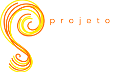

<h1 align="center">
    
</h1>

## :sun_with_face: O que é a Sinergia Solar?

Sinergia Solar é uma... 

## 💻 Projeto

A [landing](https://sinergia-solar.github.io/sinergia-solar-v2/) page foi criada como solução... para o assignment *Show Me The Leads*, um projeto do Gama Experience que visa...

## :black_nib: Confeccionado por
O grupo é composto por dez pessoas distribuídas em 4 stacks de conhecimento: Front-end [hacker](#-Hackers), Design UI/UX [hipster](#-Hipsters), Inside Sales [hustler](#-hustlers) e 
Growth Hacking [hyper](#-Hypers). 

### Hipsters
- [Caroline Velane](https://www.linkedin.com/in/caroline-velane/) + 
[Laura Mortari](https://www.linkedin.com/in/lauramortari/) 

### Hackers
- [Bruno Nishimura](https://www.linkedin.com/in/bruno-nishimura/) + [Felipe Pugas](https://www.linkedin.com/in/felipe-pugas/) + [Murilo Gomes](https://www.linkedin.com/in/murilo-lb-gomes/)

### Hustlers
- [Ramon Bartilheiro](https://www.linkedin.com/in/ramon-roberto-andrade-bartilheiro-3365861b7/) + [Alyne Fabregues](https://www.linkedin.com/in/alynefabregues/)

### Hypers
- [Felipe Lima](https://www.linkedin.com/in/felipelimact/) + [Camila Torrente](https://www.linkedin.com/in/ctorrente/)

## Tecnologias

Este projeto foi desenvolvido utilizando:

- [HTML5](https://developer.mozilla.org/pt-BR/docs/Web/HTML/HTML5)
- [CSS3](https://developer.mozilla.org/pt-BR/docs/Web/CSS)
- [Javascript](https://developer.mozilla.org/pt-BR/docs/Glossario/JavaScript)

## 🔖 Layout

Para acessar nosso layout clique [Figma](https://www.figma.com/file/NaAMIXJcdcZWnb0PA5bTHu/Sinergia-Solar?node-id=0%3A1).

## :memo: Licença

Esse projeto está sob a licença MIT. Veja o arquivo [LICENSE](https://github.com/Sinergia-Solar/sinergia-solar-v2/blob/main/LICENSE) para mais detalhes.

